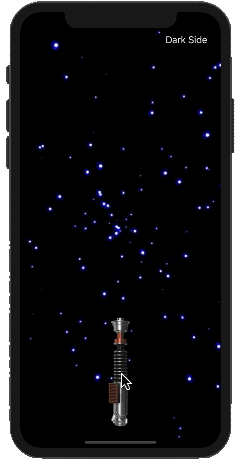

# Lightsaber

Lightsaber is an iOS motion gesture app, a throwback to the early iPhone days and the single color lightsaber apps. I was inspired by such apps and decided to try my hand at coding my own virtual lightsaber. The lightsaber opens with a tap of a button, and lightsaber sound effects are played with each swing of your iPhone. The app currently features two lightsabers, Luke Skywalker's and Darth Vader's.

I am really happy with this project, however, it is not at it's final version as I plan to add various more lightsabers. Lightsaber was my first app built using the MVC model, to which I feel very accomplished in doing and have since then continued to use the MVC architecure in all my projects. Additionally, Lightsaber utilizes Auto Layout (no storboard) for UI design, UIView animations, and UIEvent motion gestures.

&nbsp;&nbsp;&nbsp;&nbsp;&nbsp;&nbsp;&nbsp;&nbsp;&nbsp;&nbsp;

